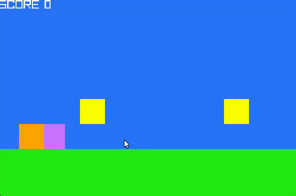

# squirreljump

 

```txt
THIS IS A BAD PLATFORMER GAME I HANDROLLED IN ABOUT 2 HOURS AT HOME TO KEEP MY BRAIN C++IFIED
    made with raylib(tm)

---- some learning notes ----

BE CAREFUL WITH TYPES
    YOU ARE APPLYING FLOAT VELOCITIES TO INT POSITIONS WITH IMPLICIT CASTING
    THIS WORKS FOR NOW BUT BE CAREFUL

=== THING I (re)LEARNED ===

    Rectangle player_hitbox{static_cast<float>(playerX),
                            static_cast<float>(playerY),
                            PLAYER_SIZE,
                            PLAYER_SIZE};

    for (auto iter = coins.begin();
         iter != coins.end();) // continue iterating until the iterator becomes null
    {
      Rectangle coin_hitbox{static_cast<float>(iter->xpos),
                            static_cast<float>(iter->ypos),
                            COIN_SIZE,
                            COIN_SIZE};

      if (CheckCollisionRecs(player_hitbox, coin_hitbox))
      {
        iter = coins.erase(iter); // iterator updated HERE
        PlaySound(pickupCoin);
      }
      else
      {
        ++iter; // move on to next item if no removals were performed
      }
    }

------ use this pattern when removing from a loop as we go
        required since end of the list changes as we pop items!!!

---- also std::Format is nice way to get strings done!!!!
            (u need c++20 tho rip)
```
